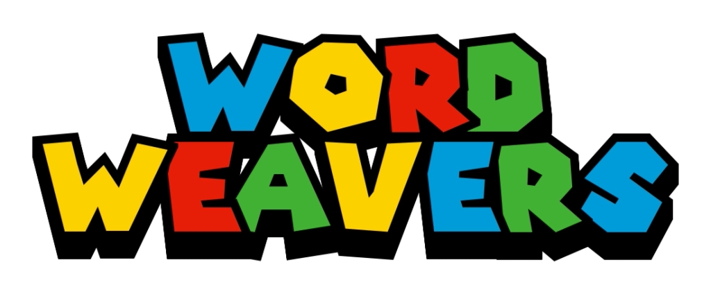
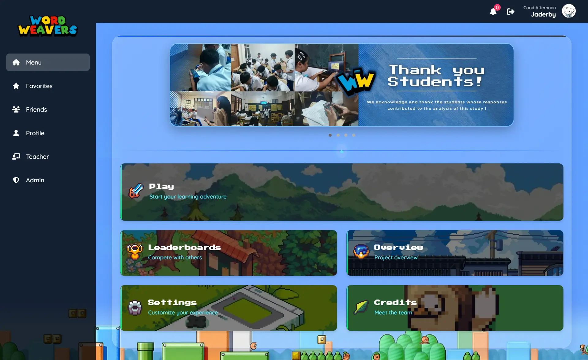
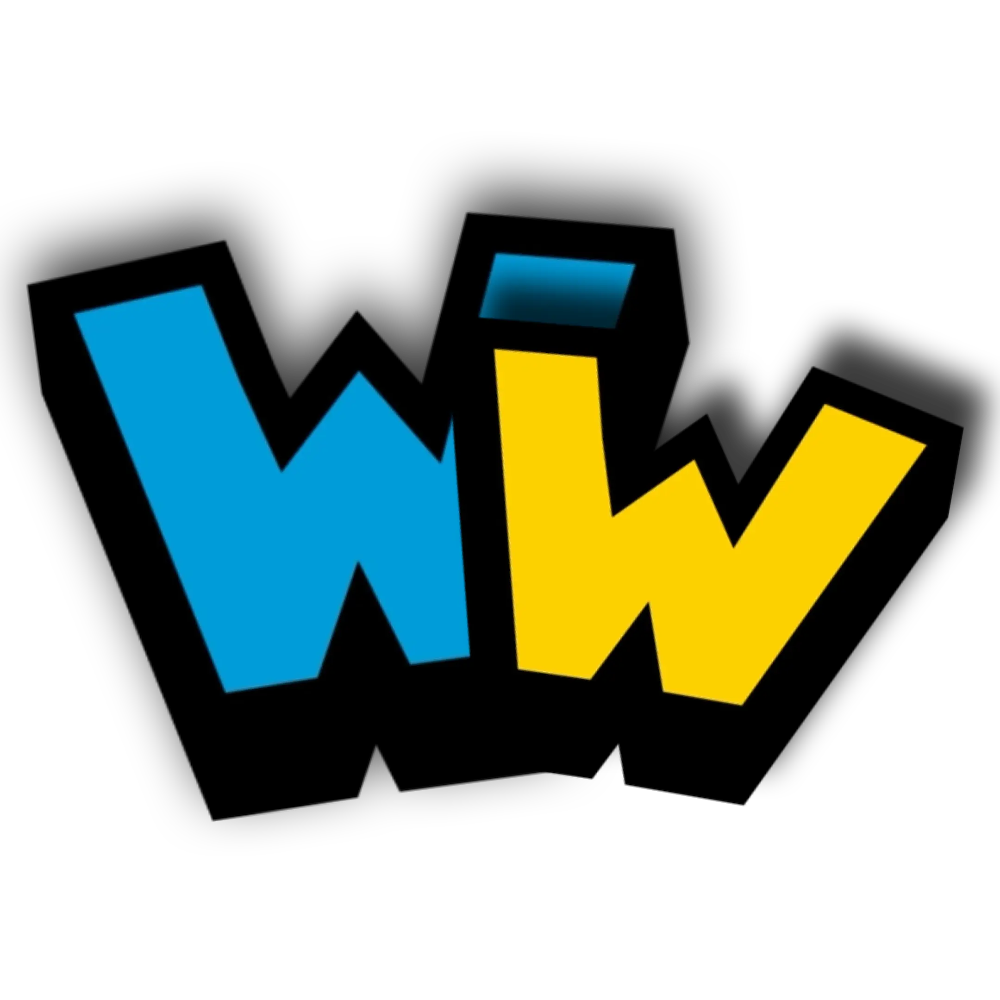

<div align="center">

# <a href="https://wordweavershccci.online"></a>

A comprehensive web-based educational platform originally developed as an academic capstone and now adaptable as a broader edtech product. Word Weavers helps learners improve English skills through immersive language arts web games, guided practice, and social learning features.

</div>

## Project Overview



**Word Weavers** is designed as an accessible English-learning platform for anyone who wants playful, structured language practice. Through interactive games, guided lessons, progress tracking, and social features, learners can improve vocabulary, grammar, reading comprehension, and communication skills while enjoying the process.

## Key Features

### Public Access

- Secure user registration with email verification
- OTP-based authentication system
- Real-time progress tracking and platform performance scoring
- Global leaderboards and achievement system
- Interactive game selection interface
- Guided learning paths with creator-curated lessons

### Game Experiences

- **Vocabworld**: Top-down educational vocabulary RPG with level-based progression
- Character customization and progression system
- Save/load game functionality
- Multiple game worlds and environments
- Auto-detection currency system (Essence & Shards)
- **Grammar Heroes**: Real-time grammar action game with waves, enemies, and boss encounters

### Social Features

- Profile avatar
- Friends system with request management
- Favorites and bookmarking system
- Global Leaderboards
- Real-time notification system

### Creator Studio

- vocabulary wordbank management
- Course and lesson management
- Learner management
- Real-time learner performance analytics
- Individual progress monitoring

### Admin Console

- User moderation and management
- Profile management tools
- System audit logs and tracking
- System analytics and reporting
- Complete platform oversight

## Quick Start

###  With Docker (Recommended)

```bash
git clone https://github.com/frostjade71/GameDev-G1 GameDev-G1
cd GameDev-G1
docker-compose up -d
```

Access the application:

- **Web Interface**: http://localhost:8080 or http://localhost/GameDev-G1
- **phpMyAdmin**: http://localhost:8081

Access the application at `http://localhost/GameDev-G1` (XAMPP) or `http://localhost:8080` (Docker).

> **Security Note**: Configure your email settings in `onboarding/otp/send_otp.php` for OTP verification!

## Game System

The platform implements an engaging educational game ecosystem:

### Vocabworld Features

1. **Character Selection**: Choose from Ethan, Emma, Amber, and more characters
2. **Currency System**: Dual currency with Essence and Shards
3. **Level Progression**: Advance through vocabulary challenges
4. **Save System**: Persistent game progress
5. **Multiple Worlds**: Diverse game environments

### Progression Rules

- **Mastery Score Tracking**: Automatic learning progress calculation based on performance
- **Achievement System**: Unlock badges and rewards through gameplay
- **Leaderboard Rankings**: Compete globally with other learners
- **Social Integration**: Share progress and compare with friends

## Technology Stack

<p align="center">
  
</p>

## Security Features

- **Password Hashing**: bcrypt encryption for all passwords
- **Prepared Statements**: PDO with parameterized queries
- **Input Sanitization**: All user inputs are sanitized and validated
- **Session Management**: Secure session handling with HTTP-only cookies
- **Email Verification**: OTP-based account verification
- **SQL Injection Prevention**: Prepared statements throughout the application

## Usage Guide

1. **Register**: Create a new account and verify your email via OTP
2. **Profile Setup**: Complete your profile information
3. **Select Game**: Choose from available game modes
4. **Character Selection**: Pick your character and customize
5. **Play & Learn**: Progress through vocabulary challenges
6. **Track Progress**: Monitor your Mastery Score and achievements
7. **Social Features**: Connect with friends and compare progress
8. **Favorites**: Bookmark content for quick access

## Contributing

We welcome contributions!

1. Fork the repository
2. Create a feature branch (`git checkout -b feature/NewFeature`)
3. Commit your changes (`git commit -m 'Add NewFeature'`)
4. Push to the branch (`git push origin feature/NewFeature`)
5. Open a Pull Request

## License

This project is provided under a custom **Educational / Source Available License**. See the [LICENSE](LICENSE.md) file for details.

---

## **Credits**  Group 3 Computer Science Seniors

> #### Documentation & QA/Testers:

- Alfred Estares
- Loren Mae Pascual
- Jeric Ganancial
- Ria Jhen Boreres
- Ken Erickson Bacarisas

> #### **Developer**

- **Jaderby Peñaranda**

  [](https://gravatar.com/jaderbypenaranda) [](mailto:jaderbypenaranda@gmail.com)

---

<div align="left">
  
  <span><b>Word Weavers</b></span>
  <span style="margin-left: 10px;"><i>Empowering Learners Through Interactive Education</i></span>
</div>

---

**Version**: 2.4.0
**Last Updated**: February 15, 2026
